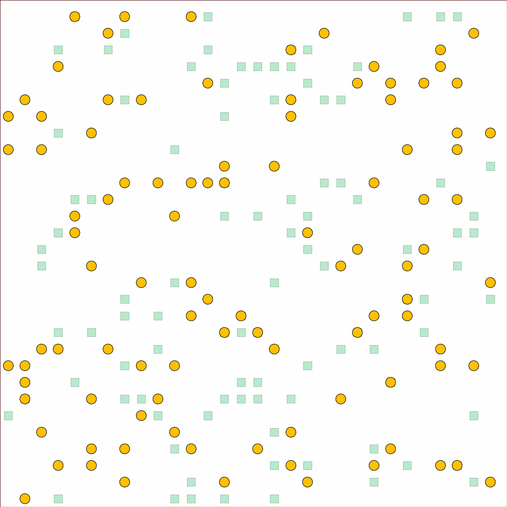

# Unlabled multi-robot path planning on graphs
1. max-flow based 
2. distance optimal unlabled MRPP (odo)

## Requirement
1. [Ortools Library](https://developers.google.com/optimization)
2. [Boost Library](https://www.boost.org/)

## Run
`cmake .`

`make` 

## Visualization
`python3 visualize.py map_file.map path_file.json`

## Demo

# Reference
1. [Yu, J., & LaValle, S. M. (2013). Multi-agent path planning and network flow. In Algorithmic foundations of robotics X (pp. 157-173). Springer, Berlin, Heidelberg.](https://arxiv.org/pdf/1204.5717.pdf) 
2. [Yu, J., & LaValle, M. (2012, December). Distance optimal formation control on graphs with a tight convergence time guarantee. In 2012 IEEE 51st IEEE Conference on Decision and Control (CDC) (pp. 4023-4028). IEEE.](https://ieeexplore.ieee.org/stamp/stamp.jsp?arnumber=6426233)
